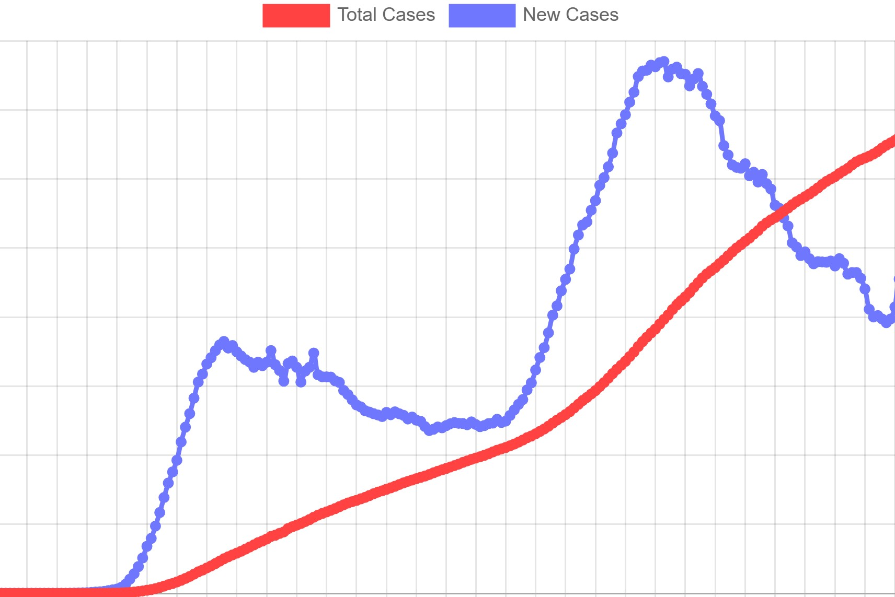

# Covid Data Visualizer



## Description

An application to visualize large public datasets on COVID-19 using different chart types.

## Usage

After launching the application, you'll encounter the following pages:

- **US Cases**
- **Average Cases and Deaths**
- **Top 5 Radar**
- **Max Difference**
- **Positive Rates**

Each page has its own data visualization and descripition.

**NOTE**: Dataset last updated on 10/16/2020.

## Dependencies

- Python 3: Required for running the Python code.
- pandas: Python data manipulation and analysis library for processing COVID-19 datasets.
- Django: Python web framework used for backend structure and serving web pages for COVID-19 data visualization.

## Installation

1. Clone the repository:
   ```bash
   git clone https://github.com/GiovanniCornejo/CovidDataViz.git
   cd CovidDataViz
   ```
2. Start up the Django application:
   ```bash
   python manage.py migrate
   python manage.py runserver
   ```
3. Visit the development server in a browser of your choice.

## License

This project is licensed under the [MIT License](LICENSE).
